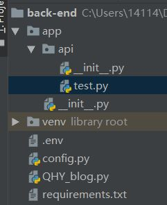
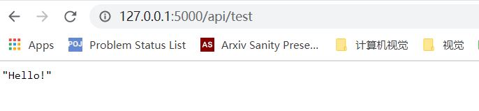

# 初始搭建

**技术栈**：flask + vue + sql 

**代码管理：**github


创建目录QHY_BLOG

## 后端搭建

在QHY_BLOG目录下创建一个python项目back-end，再在back-end下安装flask

` pip install flask` 

`pip freeze > requirements.txt` 


创建

config.py、QHY_blog.py、.env三个文件以及目录app，

在目录app下创建目录api和文件\__init__.py

在目录api下创建文件\__init__.py和test.py

最终目录图如下图所示：




config.py存放配置

.env存放系统环境变量

QHY_blog.py是启动文件

api目录下存放的是我们写的各个后端接口

app目录？？？？？？？？？？？？？？？？？？？？？？？？？？

test.py是为了测试flask的后端连通性


back-end\\.env文件：

```python
FLASK_APP=QHY_blog.py  
FLASK_DEBUG=1  
```

第一行使得命令行使用flask run语句启动时无需指明启动文件

第二行作用：为debug模式


但此时使用flask run会报错，因为我们还没有将该环境文件读入flask中。为了读入环境变量, 使用dotenv这个包

```
pip install python-dotenv
pip freeze > requirements.txt
```


back-end/config.py文件中

```python
import os
from dotenv import load_dotenv
basedir = os.path.abspath(os.path.dirname(__file__)) # 根目录
load_dotenv(os.path.join(basedir,'.env')) # 导入环境文件

class Config(object):
    pass
```


app/api/\__init__.py文件下:

```
from flask import Blueprint


bp = Blueprint('api',__name__) #注册蓝图(blueprint)

# 写在最后是为了防止循环导入bp
from app.api import test
```

蓝图（blueprint）是vue提供的一种管理url的工具，https://www.jianshu.com/p/7c474ee9ffee


api/test.py:

```
from flask import jsonify
from app.api import bp

@bp.route('/test', methods=['GET'])
def test():
    '''前端Vue.js用来测试与后端Flask API的连通性'''
    return jsonify('Hello!')
```


app/\__init__.py:

```python
from flask import Flask
from config import Config

def create_app(config_class=Config):
    app = Flask(__name__) #创建flask应用
    app.config.from_object(config_class) #导入config设置

    from app.api import bp as api_bp  
    app.register_blueprint(api_bp,url_prefix='/api') #注册蓝图，要使用该蓝图即加前缀/api

    return app
```


QHY_blog.py下：

```python
from app import create_app

app = create_app()
```


此时在命令行下启动应用

```
(venv) C:\Users\14114\Desktop\QHY_BLOG\back-end>flask run

- Serving Flask app "QHY_blog.py" (lazy loading)
- Environment: production
WARNING: This is a development server. Do not use it in a production deployment.
Use a production WSGI server instead.
- Debug mode: on
- Restarting with stat
- Debugger is active!
- Debugger PIN: 160-004-048
- Running on http://127.0.0.1:5000/ (Press CTRL+C to quit)
```


 此时输入 127.0.0.1:5000/api/test将出现如下画面



api/test

如前所言，蓝图用于管控url，而api下所有文件url前缀为api/，

test的url为test，所以当url为api/test时即到达这里，方法为GET

（link……………………什么是get？什么是post？戳这里！)

`@bp.route('/test', methods=['GET'])`


## 前端搭建

安装node.js

npm很慢的话可以换成cnpm，国内源会快些

```
npm install -g cnpm --registry=https://registry.npm.taobao.org
```

安装vue-Cli

```
cnpm install -g vue-cli
```


