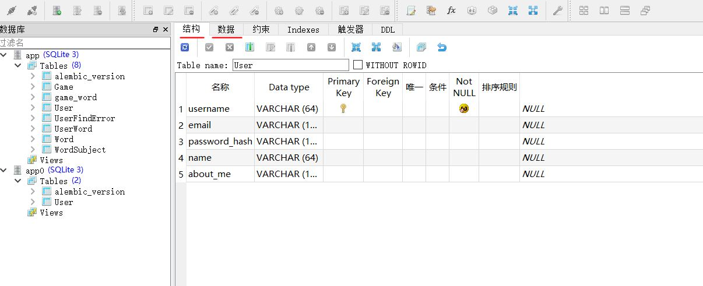

# 初始搭建

**技术栈**：flask + vue + sql 

**代码管理：**github


创建目录QHY_BLOG

## 后端搭建

在QHY_BLOG目录下创建一个python项目back-end，再在back-end下安装flask

` pip install flask` 

`pip freeze > requirements.txt` 


创建

config.py、QHY_blog.py、.env三个文件以及目录app，

在目录app下创建目录api和文件\__init__.py

在目录api下创建文件\__init__.py和test.py

最终目录图如下图所示：


config.py存放配置

.env存放系统环境变量

QHY_blog.py是启动文件

api目录下存放的是我们写的各个后端接口

app目录就是我们创建该项目的几乎所有内容，模型、api等等

test.py是为了测试flask的后端连通性


`back-end\\.env`文件：

```python
FLASK_APP=QHY_blog.py  
FLASK_DEBUG=1  
```

第一行使得命令行使用flask run语句启动时无需指明启动文件

第二行作用：为debug模式


但此时使用flask run会报错，因为我们还没有将该环境文件读入flask中。为了读入环境变量, 使用dotenv这个包

```
pip install python-dotenv
pip freeze > requirements.txt
```


`back-end/config.py`文件中

```python
import os
from dotenv import load_dotenv
basedir = os.path.abspath(os.path.dirname(__file__)) # 根目录
load_dotenv(os.path.join(basedir,'.env')) # 导入环境文件

class Config(object):
    pass
```


`app/api/__init__.py`文件下:

```
from flask import Blueprint


bp = Blueprint('api',__name__) #注册蓝图(blueprint)

# 写在最后是为了防止循环导入bp
from app.api import test
```

蓝图（blueprint）是vue提供的一种管理url的工具，https://www.jianshu.com/p/7c474ee9ffee


`api/test.py`:

```
from flask import jsonify
from app.api import bp

@bp.route('/test', methods=['GET'])
def test():
    '''前端Vue.js用来测试与后端Flask API的连通性'''
    return jsonify('Hello!')
```


`app/__init__.py`:

```python
from flask import Flask
from config import Config

def create_app(config_class=Config):
    app = Flask(__name__) #创建flask应用
    app.config.from_object(config_class) #导入config设置

    from app.api import bp as api_bp  
    app.register_blueprint(api_bp,url_prefix='/api') #注册蓝图，要使用该蓝图即加前缀/api

    return app
```


`QHY_blog.py`：

```python
from app import create_app

app = create_app()
```


此时在命令行下启动应用

```
(venv) C:\Users\14114\Desktop\QHY_BLOG\back-end>flask run

- Serving Flask app "QHY_blog.py" (lazy loading)
- Environment: production
WARNING: This is a development server. Do not use it in a production deployment.
Use a production WSGI server instead.
- Debug mode: on
- Restarting with stat
- Debugger is active!
- Debugger PIN: 160-004-048
- Running on http://127.0.0.1:5000/ (Press CTRL+C to quit)
```


 此时输入 `127.0.0.1:5000/api/test`将出现如下画面


api/test

如前所言，蓝图用于管控url，而api下所有文件url前缀为api/，

test的url为test，所以当url为api/test时即到达这里，方法为GET

（link……………………什么是get？什么是post？？？？？？？？？戳这里！)

`@bp.route('/test', methods=['GET'])`


## 前端搭建

安装node.js

npm很慢的话可以换成cnpm，国内源会快些

```
npm install -g cnpm --registry=https://registry.npm.taobao.org
```

安装vue-Cli

```
cnpm install -g vue-cli
```

初始化前端项目

```
C:\Users\14114\Desktop\QHY_BLOG>vue init webpack front-end

? Project name front-end
? Project description A Vue.js project
? Author HaoyueQiu <1411434056@qq.com>
? Vue build standalone
? Install vue-router? Yes
? Use ESLint to lint your code? No
? Set up unit tests No
? Setup e2e tests with Nightwatch? No
? Should we run `npm install` for you after the project has been created? (recommended) no

   vue-cli · Generated "front-end".
```


``` (venv) C:\Users\14114\Desktop\QHY_BLOG\front-end>cnpm install
(venv) C:\Users\14114\Desktop\QHY_BLOG\front-end>cnpm install
(venv) C:\Users\14114\Desktop\QHY_BLOG\front-end>npm run dev
 
 I  Your application is running here: http://localhost:8080

```

这时打开localhost:8080将看到如下效果图


修改`front-end/src/components/HelloWorld.vue`

```vue
<template>
  <div>
    <p>{{msg}}</p>
  </div>
</template>

<script>
  import axios from 'axios'
  export default {
    name:'test',
    data(){
      return{
        msg:'Hello World',
      }
    }
</script>
```


修改`index.js`

```js
import Vue from 'vue'
import Router from 'vue-router'
import test from '@/components/HelloWorld'

Vue.use(Router);

export default new Router({
  routes: [
    {
      path: '/test',//路径
      name: 'HelloWorld',//该模块的命名
      component: test,  //export default出的组件名字
    },
  ]
})
```

此时打开test将会出现


## 前后端交互

**下面考虑前后端交互**

使用axios让前端向后端发送请求

`C:\Users\14114\Desktop\QHY_BLOG\front-end>cnpm install axios --save`


```vue
<script>
  import axios from 'axios'
  export default {
    name:'test',
    data(){
      return{
        msg:'Hello World',
      }
    },
    methods:{
      testBackEnd() {
        const path='http://localhost:5000/api/test'
        axios.get(path)
          .then((res) => {
            this.msg = res.data;
          })
          .catch((error) => {
            console.log(error)
          })
      }
    },
    created() {
      this.testBackEnd();
    }
  }
</script>

```


但由于前后端端口不一致，此时还无法成功发送请求，为了解决这个问题，后端安装flask-Cors插件

`(venv) C:\Users\14114\Desktop\QHY_BLOG\back-end>pip install flask-Cors`

修改`app/__init__.py`如下

```python
from flask import Flask
from config import Config
from flask_cors import CORS

def create_app(config_class=Config):

    app = Flask(__name__) #创建flask应用
    app.config.from_object(config_class) #导入config设置

    CORS(app)
    
    from app.api import bp as api_bp
    app.register_blueprint(api_bp,url_prefix='/api') #注册蓝图，要使用该蓝图即加前缀/api

    return app
```


如果每次发送请求都要写 

`path='http://localhost:5000/api/...'`

不仅十分麻烦，而且不利于后续部署，如果部署在云上，ip地址和端口将会更，到时候到处找发请求的地方修改地址非常愚蠢且很慢，所以对axios进行全局配置。

创建`front-end/src/http.js`文件

```js
import axios from 'axios'

axios.defaults.timeout = 5000;
axios.defaults.baseURL = 'http://localhost:5000/api'; //设置baseURL，以后需要修改在此处修改即可

export default axios
```

全局配置需要在main.js中引用挂载

所以修改`front-end/src/main.js`:

```js
// The Vue build version to load with the `import` command
// (runtime-only or standalone) has been set in webpack.base.conf with an alias.
import Vue from 'vue'
import App from './App'
import router from './router'
import axios from './http'

Vue.config.productionTip = false;
Vue.prototype.$axios = axios;

/* eslint-disable no-new */
new Vue({
  el: '#app',
  router,
  components: { App },
  template: '<App/>'
})
```


此时对于`HelloWorld.vue`的请求便可以修改为如下

```js
//const path='http://localhost:5000/api/test'
//axios.get(path)
const path = 'test';
this.$axios.get(path)
    .then((res) => {
    	this.msg = res.data;
    })
    .catch((error) => {
    	console.log(error)
    })
```


## 数据库

使用SQLite数据库

``` 
back-end> pip install flask-sqlalchemy flask-migrate
```


修改`config.py`文件

``` python
class Config(object):
    SQLALCHEMY_DATABASE_URI = os.environ.get('DATABASE_URL') or'sqlite:///' + os.path.join(basedir, 'app.db')
    SQLALCHEMY_TRACK_MODIFICATIONS = False
```

`app/__init__.py` 文件引入数据库：

```python
from flask import Flask
from config import Config
from flask_cors import CORS
from flask_sqlalchemy import SQLAlchemy
from flask_migrate import Migrate


# Flask-SQLAlchemy 插件
db = SQLAlchemy()
# Flask-Migrate 插件
migrate = Migrate()

def create_app(config_class=Config):
    app = Flask(__name__)  # 创建flask应用
    app.config.from_object(config_class)  # 导入config设置

    CORS(app)
    # 数据库初始化
    db.init_app(app)
    # 迁移初始化
    migrate.init_app(app, db)

    from app.api import bp as api_bp
    app.register_blueprint(api_bp, url_prefix='/api')  # 注册蓝图，要使用该蓝图即加前缀/api

    return app


from app import models
```


而后新建`app/models.py`文件,创建所需的表

```python
from app import db


class User(db.Model):
    __tablename__ = 'User'
    username = db.Column(db.String(64), primary_key=True, index=True, unique=True)
    email = db.Column(db.String(120), index=True, unique=True)
    password_hash = db.Column(db.String(128))  # 不保存原始密码
    name = db.Column(db.String(64))
    about_me = db.Column(db.String(128))
   
```


通过以下三个命令创建并迁移数据库。

`init` 初始化，`migrate`命令创建迁移脚本，`upgrade` 将该脚本应用。

``` python
back-end>flask db init
back-end>flask db migrate -m "add user table"
back-end>flask db upgrade
```


由于`SQLite` 默认不支持删除列所以如果要修改表会比较麻烦，可以通过`batch_alter_table` 解决。

不过我通常喜欢用`SQLiteStudio`管理数据库，`SQLiteStudio`可以直接创建表格，也可以直接在数据那一列添加删减数据，可视化操作很方便。

不过要记得在表格有变时将models文件进行对应的修改就可以了。(因为程序内改变数据库是要调用model的，要保证model和数据库对应才不会报错)




至此为止，前后端的基础搭建和数据库的引入完成了！

