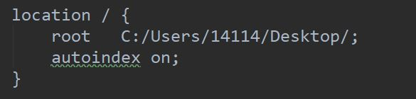

#  如何上传博客

## mark-down 编辑器

`mavon-editor` 

安装，引用。能够正常展示出markdown编辑器


博客存储问题，一定要存在数据库里么？数据库只存 博客路径和名称可以么？然后展示界面对markdown进行渲染即可。

last update: 即为电脑问文件的本地时间


博客存储在本地，直接配置路径，到对应文件夹进行渲染展示即可。后端读入md文件，传给前端

博客： 博客序号，博客标题，路径(文件夹名称)，上次更新(加入的时间)，多少点击量，标签，分类

评论:   评论者名称，电子邮箱，评论内容。 如果已经登录可以直接发表评论内容，否则需要填上评论者名称和电子邮箱。


博客与评论的关系：一对多

!

```python
class Post(PaginatedAPIMixin, db.Model):
    __tablename__ = 'posts'
    id = db.Column(db.Integer, primary_key=True) # 博客id
    title = db.Column(db.String(255)) # 标题
    loc = db.Column(db.Text) #博客路径/所在文件夹。 因为我在本地写博客喜欢文件夹分类，传入的是总路径，所以还需要把次级路径传进去
    timestamp = db.Column(db.DateTime, index=True, default=datetime.utcnow) #时间戳
    views = db.Column(db.Integer, default=0) #多少人看过该文章
    

    def __repr__(self):
        return '<Post {}>'.format(self.title)
    
    
class Comment(db.Model)
```


下一步，关于博客路径问题，能否导入本地博客？


1. 前端渲染博客：即通过传入.md路径，使得前端能够正常展示出来。
2. 后端建立模型，将博客对应信息存储。
3. 前后端连接，能够正常请求一篇博客。
4. 前端播客流展示
5. 前端博客分类展示


想把markdown格式的博客能展示到网页上，我使用了mavonEditor这个插件，它能够解析markdown语法。但是碰到的问题是图片无法正常显示(我把图片放到static下了)。它原始的做法是会自动上传图片到服务器上，然后需要时再获取。

我之前瞎摸了好久没理解，因为我的思路总是局限在 md索引本地图片在网页端展示，比如放在static之类的。然后你说url，然后我试了试才发觉markdown导入图片可以直接用网络url(我都是本地写笔记所以一直用的是本地路径0.0)。然后现在就是想着用nginx索引本地文件，这样就有url了，这时候就能用mavon-editor直接解析出来了。

所以目前的问题就是用nginx静态服务器


# Nginx静态配置

首先到官网上下载Nginx，按照该教程 https://blog.csdn.net/happysong8783/article/details/80665530 进行配置。

需要注意的点是y以下配置

location如果不想把原始的/删除掉，比如像博客那样写成location  /work/, 那么root那里最后就不用写 /work/了。这不单单url的映射，还是指定本地文件的位置。




遇到的问题

1. 后端：根据url下载文件并打开文件，因为这是无法直接open打开的。使用了urllib库

urllib 和 request的区别，二者都是python发请求的库，urllib内置。目前urllib2合并进urllib了，urllib.request就是urllib2了。 至于如何print出正常文本,.decode('utf-8')

1. 发现图片无法正常解析，发现是图片url带空格的问题，空格需要换成%20的编码，改了那个批操作代码应用该替换。

1. Latex 语法格式无法解析，获取mavon-Editor的markdownIt，而后下载一个 markdown-it-katex插件，引入后能够成功解析。中间又碰到了一个问题是二者解析公式时KaTeX的$$后面不能带空格 ，而这种写法在typora中能够被解析的。所以又改了那个批操作代码把空格去掉。

现在总算实现了传入路径读入md文件传给前端并实现正常的解析。