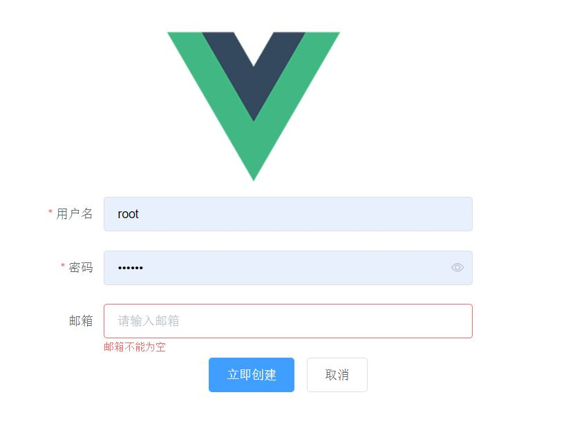
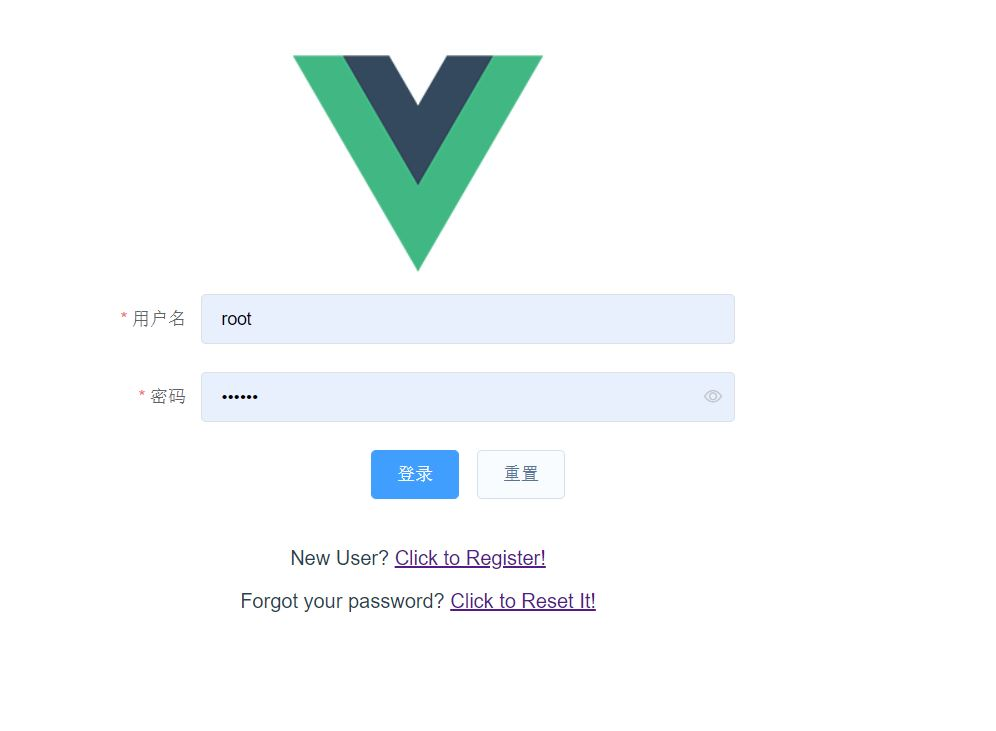
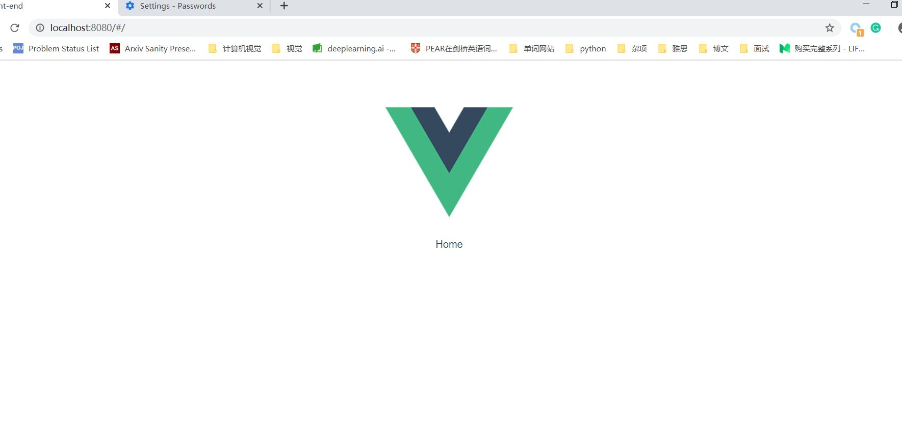

# 登录注册

## 总述

登录注册功能：能够实现用户注册登录，并保持一段时间的登录，采用JWT进行认证。


**主要思路：**

1. 完善models User中需要用到的方法，比如获取和验证JWT、表和字典形式的相互转化以便前后端交互、以及密码的修改与验证。

2. error、auth、token功能
3. 前端页面的编写，前后端交互


## model User

首先安装JWT

`back-end>pip install pyjwt`

JWT介绍的文章

https://baijiahao.baidu.com/s?id=1608021814182894637&wfr=spider&for=pc

https://www.jianshu.com/p/576dbf44b2ae


在配置文件 `back-end/config.py` 中添加配置项: 

``` python
class Config(object):
    # ...
    '''
    配置pyjwt
    jwt库，它允许在token中添加一些不是隐私数据的payload。
    '''
    SECRET_KEY = os.environ.get('SECRET_KEY') or 'you-will-never-guess'
    '''
    os.environ是一个存取环境变量的类，环境变量的值用get方法获取，这里是获取名称为'SECRET_KEY'环境变量的值。如果不存在则返回'you-will-never-guess'
    '''
```


修改 `models.py`

```python
import base64
import jwt
import os
from app import db
from datetime import datetime, timedelta
from flask import url_for, current_app
from werkzeug.security import generate_password_hash, check_password_hash


class User(db.Model):
    __tablename__ = 'User'
    username = db.Column(db.String(64), primary_key=True, index=True, unique=True)
    email = db.Column(db.String(120), index=True, unique=True)
    password_hash = db.Column(db.String(128))  # 不保存原始密码
    name = db.Column(db.String(64))
    about_me = db.Column(db.String(128))

    # 在打印的时候更好看，不会愚蠢的输出类的信息
    def __repr__(self):
        return '<User {}>'.format(self.username)

    def set_password(self, password):
        self.password_hash = generate_password_hash(password)

    def check_password(self, password):
        return check_password_hash(self.password_hash, password)

    #todict和fromdict主要用于前后端交互，它们之间传递的是JSON对象。
    def to_dict(self, include_email=False):
        data = {
            'username': self.username,
            'name': self.name,
            'about_me': self.about_me,
        }

        if include_email:
            data['email'] = self.email
        return data

    def from_dict(self, data, new_user=False):
        for field in ['username', 'email']:
            if field in data:
                setattr(self, field, data[field])
        if new_user and 'password' in data:
            self.set_password(data['password'])

    def get_jwt(self, expires_in=600):
        now = datetime.utcnow()
        # 将用户id和名称等信息作为payload加入token中
        payload = {
            'username': self.username,
            'name': self.name if self.name else self.username,
            'exp': now + timedelta(seconds=expires_in),
            'iat': now
        }
        # 使用jwt的加密算法进行加密
        return jwt.encode(
            payload,
            current_app.config['SECRET_KEY'],
            algorithm='HS256').decode('utf-8')

    @staticmethod
    def verify_jwt(token):
        try:
            # 进行解密验证
            payload = jwt.decode(
                token,
                current_app.config['SECRET_KEY'],
                algorithms=['HS256'])
            # 如果token过期那么就验证失败，否则就返回id
        except jwt.exceptions.ExpiredSignatureError as e:
            return None
        # return payload
        return User.query.get(payload.get('username'))
```


## 一些api 

### 创建用户

`api/users.py` 

```python
# coding=utf-8
import re
from app import db
from app.api import bp
from app.api.auth import token_auth
from app.api.errors import bad_request
from app.models import User
from flask import request, jsonify


@bp.route('/users', methods=['POST'])
def create_user():
    """ 注册一个新用户 """
    data = request.get_json()
    if not data:
        return bad_request('You must post JSON data.')

    message = {}
    '''
    判断数据库是否已经存在这些 username 和 email,关于email的格式、username是否为空这些简单的逻辑放在了前端。
    '''
    if User.query.filter_by(username=data.get('username', None)).first():
        message['username'] = '该用户名已被使用，请使用其它用户名。Please use a different username.'
    if User.query.filter_by(email=data.get('email', None)).first():
        message['email'] = '该邮箱已被使用，请使用其它邮箱。Please use a different email address.'

    if message:
        return bad_request(message)

    user = User()
    user.from_dict(data, new_user=True)
    db.session.add(user)
    db.session.commit()
    response = jsonify(user.to_dict())
    response.status_code = 201
    return response
```

### 错误处理

`api/errors.py`

```python
# coding=utf-8
from app import db
from app.api import bp
from flask import jsonify
from werkzeug.http import HTTP_STATUS_CODES


def error_response(status_code, message=None):
    payload = {'error': HTTP_STATUS_CODES.get(status_code, 'Unknown error')}
    if message:
        payload['message'] = message
    response = jsonify(payload)
    response.status_code = status_code
    return response


@bp.app_errorhandler(400)
def bad_request(message):
    # 最常用的错误 400：错误的请求
    return error_response(400, message)


'''
在默认的http请求中，如果没有进行特别的自定义需求，那么出现404错误之类的，则会显示Not Found等信息。
如果需要在发生错误的时候，再进行一系列的业务处理，这时候就可以使用自定义的错误处理方法。

而在Flask view函数中，如果需要中断request，可以使用abort(500)或者直接抛异常raise exception。
中断request后需要返回一个出错信息给前端，所以就对errorhandler进行定制。
一般只需要两个handler即可，一个是404错误，一个是500一类的服务器端错误。
app_errorhandler 会自动捕捉全局状态码，如此便可以进行错误定制

'''
@bp.app_errorhandler(404)
def not_found_error(error):
    return error_response(404)

@bp.app_errorhandler(500)
def internal_error(error):
    db.session.rollback()
    return error_response(500)


```


### Basic Auth

`api/auth.py`

使用装饰器实现basic auth

```python
# coding=utf-8
from app.api.errors import error_response
from app.models import User
from flask import g
from flask_httpauth import HTTPBasicAuth, HTTPTokenAuth

basic_auth = HTTPBasicAuth()
token_auth = HTTPTokenAuth()


'''
Basic Auth是配合RESTful API使用的最简单的认证方式，客户端向服务器发请求时，会在请求的http header中提供用户名和密码作为认证信息
Flask虽然没有集成Basic Auth的实现，但相关信息均已提供，只需对basic auth装饰器进行简单封装即可实现Basic Auth，而后将该装饰器应用到需要使用basic auth的API中
https://www.jianshu.com/p/5e21506a9990
'''
@basic_auth.verify_password
def verify_password(username, password):
    """用于检查用户提供的用户名和密码"""
    user = User.query.filter_by(username=username).first()
    if user is None:
        return False
    g.current_user = user
    return user.check_password(password)


@basic_auth.error_handler
def basic_auth_error():
    """用于在认证失败的情况下返回错误响应"""
    return error_response(401)


@token_auth.verify_token
def verify_token(token):
    """用于检查用户请求是否有token，并且token真实存在，还在有效期内"""
    g.current_user = User.check_token(token) if token else None
    return g.current_user is not None


@token_auth.error_handler
def token_auth_error():
    """用于在 Token Auth 认证失败的情况下返回错误响应"""
    return error_response(401)
```


### 获取token

`api/token.py`

```python
from flask import jsonify, g
from app import db
from app.api import bp
from app.api.auth import basic_auth


@bp.route('/tokens', methods=['POST'])
@basic_auth.login_required
def get_token():
    token = g.current_user.get_jwt()
    # 每次用户登录，更新token
    db.session.commit()
    return jsonify({'token': token})
```


每次完成`api`后要记得在`api\__init__.py` 文件进行导入

```python
from app.api import test, auth, errors, token, users
```


## 前端

### elementUI

引入element-UI

官方下载 `npm i element-ui -S` 

但是我狂报错

网上没有搜到相关方案，我尝试按照它报错的原因，手动删除错误源。结果删一个来一个，整了好久。

最后换了cnpm安装就成功了，我佛了。。。

按照官方教程在main.js配置引入一下即可。


```
import ElementUI from 'element-ui';
import 'element-ui/lib/theme-chalk/index.css';

Vue.use(ElementUI);
```


`components/Home.vue`：暂且未设计主界面做什么，先放一个hello！

```vue
<template>
  <div class="container">
    <p>Home</p>
  </div>
</template>


<script>
export default {
  name: 'Home',  //this is the name of the component
  components: {
  },
  data () {
    return {}
  }
}

</script>
```


### 存储用户名等信息

`src/store.js`

```json
export default {
  state: {
    is_authenticated: false,
    username:'',
    authority: false,
  },
  loginAction(username) {
    console.log('loginAction is triggered');
    this.state.is_authenticated = true
    this.state.username = username
  },
  logoutAction() {
  console.log('logoutAction is triggered');
    window.localStorage.removeItem('blog-token');
    this.state.is_authenticated = false;
    this.state.username = ''
  },
}
```


### 注册

注册功能：

表格：用户名、密码、邮箱

在前端需要判断这三项是否为空，密码长度，以及邮箱是否符合格式，这些简单的逻辑不需要传到后端判断。

elementUI有自带的表单验证非常方便。

创建成功后跳转到登录界面

`components/Register.vue`:

```vue
<template>
  <div>
    <el-row>
      <el-col :span="8">
        <p></p>
        <el-button
          plain
          @click="openError"
          v-show="false">
        </el-button>

      </el-col>
      <el-col :span="8">

        <!--  ref的作用  https://www.jianshu.com/p/623c8b009a85-->
        <!-- 表单验证Vue组件库element-ui中的Form表单组件提供了表单验证功能
              通过rules属性传入验证规则
              Form-Item中的prop属性设置需要校验的字段名
        -->
        <el-form ref="registerForm" :model="registerForm" :rules="rules" label-width="80px">
          <el-form-item label="用户名" prop="username">
            <el-input v-model="registerForm.username"></el-input>
          </el-form-item>
          <el-form-item label="密码" prop="password">
            <el-input placeholder="请输入密码" v-model="registerForm.password" show-password></el-input>
          </el-form-item>
          <el-form-item label="邮箱" prop="email">
            <el-input
              placeholder="请输入邮箱"
              v-model="registerForm.email"
              clearable>
            </el-input>
          </el-form-item>
          <el-form-item>
            <el-button type="primary" @click="onSubmit">立即创建</el-button>
            <el-button>取消</el-button>
          </el-form-item>
        </el-form>

      </el-col>
      <el-col :span="8">
      </el-col>
    </el-row>

  </div>
</template>

<script>
  export default {
    data() {
      let checkEmail = (rule, value, callback) => {
        const mailReg = /^([a-zA-Z0-9_-])+@([a-zA-Z0-9_-])+(.[a-zA-Z0-9_-])+/;
        if (!value) {
          return callback(new Error('邮箱不能为空'))
        }
        setTimeout(() => {
          if (mailReg.test(value)) {
            callback()
          } else {
            callback(new Error('请输入正确的邮箱格式'))
          }
        }, 100)
      };
      return {
        registerForm: {
          name: '',
          username: '',
          email: '',
          password: '',
          errors: 0,  // 表单是否在前端验证通过，0 表示没有错误，验证通过
          createError: null,
        },
        rules: {
          password: [
            {required: true, message: '请输入密码', trigger: 'blur'}
          ],
          username: [
            {required: true, message: '用户名不能为空', trigger: 'blur'}
          ],
          email: [
            //触发方式，blur失去焦点，change数据改变
            {validator: checkEmail, trigger: 'blur'}
          ]
        }
      }
    },
    methods: {
      openError() {
        this.$notify({
          title: '警告',
          message: this.createError,
          type: 'warning',
          duration: 3000,
        });
      },
      onSubmit(e) {

        const path = '/users';
        const payload = {
          username: this.registerForm.username,
          email: this.registerForm.email,
          password: this.registerForm.password
        };
        console.log(payload);
        this.$axios.post(path, payload)
          .then((response) => {
            // 成功注册，跳转到login界面
            console.log(response.data);
            this.$router.push('/login')
          })
          .catch((error) => {
            this.createError = null
            // handle error
            console.log(error.response.data.message);
            for (let field in error.response.data.message) {
              if (field == 'username') {
                this.createError = error.response.data.message.username
                this.openError()
              } else if (field == 'email') {
                this.createError = error.response.data.message.email
                this.openError()
              }
            }
            console.log(this.createError)

          })
      },
    }
  }
</script>

```

### 登录

填入的用户名密码名不可为空，传入到后端进行验证，验证通过分配一个token,并跳转到主界面

`components/Login.vue`

```vue
<template>
  <div>
    <el-row>
      <el-col :span="8">
        <p></p>
        <el-button
          plain
          @click="openError"
          v-show="false">
        </el-button>
      </el-col>
      <el-col :span="8">
        <el-form ref="registerForm" :model="loginForm" :rules="rules" label-width="80px">
          <el-form-item label="用户名" prop="username">
            <el-input v-model="loginForm.username"></el-input>
          </el-form-item>
          <el-form-item label="密码" prop="password">
            <el-input placeholder="请输入密码" v-model="loginForm.password" show-password></el-input>
          </el-form-item>
          <el-form-item>
            <el-button type="primary" @click="onSubmit">登录</el-button>
            <el-button @click="clearForm">重置</el-button>
          </el-form-item>
        </el-form>
      </el-col>
      <el-col :span="8">
      </el-col>
    </el-row>
    <p> New User?
      <router-link to="/register">Click to Register!</router-link>
    </p>
    <p>
      Forgot your password?
      <!--重置密码功能-->
      <a href="#">Click to Reset It!</a>
    </p>
  </div>
</template>

<script>
  import store from '../store.js'

  export default {
    data() {
      return {
        loginForm: {
          name: '',
          username: '',
          email: '',
          password: '',
          errors: 0,  // 表单是否在前端验证通过，0 表示没有错误，验证通过
          passwordError: null,
        },
        rules: {
          password: [
            {required: true, message: '请输入密码', trigger: 'blur'}
          ],
          username: [
            {required: true, message: '用户名不能为空', trigger: 'blur'}
          ],
        }
      }
    },
    methods: {
      openError() {
        this.$notify({
          title: '警告',
          message: this.LoginForm.passwordError,
          type: 'warning',
          duration: 3000,
        });
      },
      onSubmit(e) {
        //通过 axios 连接前后端，能够调用后端API，以下实现了auth，获得token
        //const path = 'http://localhost:5000/api/tokens'
        const path = '/tokens';
        // axios 实现Basic Auth需要在config中设置 auth 这个属性即可
        this.$axios.post(path, {}, {
          auth: {
            'username': this.loginForm.username,
            'password': this.loginForm.password,
          }
        }).then((response) => {
          //handle success;
          window.localStorage.setItem('token', response.data.token);
          window.localStorage.setItem('info:username', this.loginForm.username);
          // store.resetNotNewAction()
          store.state.username = this.loginForm.username;
          //虚假权限管理，后期修改！
          if (this.loginForm.username == "root") {
            store.state.authority = true;
          }
          store.loginAction();
          this.$router.push({path: '/'})
          //this.$router.push({path:`/profile${this.loginForm.username}`})
        })
          .catch((error) => {
            //handle error
            this.loginForm.passwordError = '密码错误 password Error!';
            this.openError();
            console.log(error.response);
          })

      },
      clearForm() {
        this.loginForm.username = '';
        this.loginForm.password = '';
      }
    }
  }
</script>
```


### 路由及路由守卫

`src/router/index.js`

```json
import Vue from 'vue'
import Router from 'vue-router'
import Home from '@/components/Home'
import Login from '@/components/Login'
import Register from '@/components/Register'


Vue.use(Router);
const router = new Router({
  routes: [
    {
      path: '/',
      name: 'Home',
      component: Home,
    },

    {
      path: '/login',
      name: 'Login',
      component: Login
    },

    {
      path: '/register',
      name: 'Register',
      component: Register

    },
  ]
});


// 导航守卫控制路由的重定向，路由跳转时会经过该函数判断
// 比如，登录过后就去不到Login界面了，有的网站要求一定要登陆才能继续接下来的操作也可以在这里实现逻辑
// https://router.vuejs.org/zh/guide/advanced/navigation-guards.html#导航守卫
router.beforeEach((to, from, next) => {
  const token = window.localStorage.getItem('blog-token');
  if (token && to.name == 'Login') {
    // 用户已登录，但又去访问登录页面时不让他过去
    next({
      path: from.fullPath
    })
  } else if (to.matched.length === 0) {  // 要前往的路由不存在时
    if (from.name) {
      next({
        name: from.name  //回到原来的路由
      })
    } else {
      next({
        path: '/' //回到主界面
      })
    }
  } else {
    next()
  }
});


export default router
```


## 实现的效果






