# Two-stream Adaptive Graph Convolutional Networks for Skeleton-Based Action Recognition （2S-AGCN）论文简略笔记

该文提出的网络中文可以翻译为 双流自适应图卷积网络(Two-stream Adaptive Graph Convolutional Networks)

关键词：two-stream， adaptive， Graph Convolutional Network

**图卷积网络(Graph Convolutional Network)**: 该图卷积网络基本架构来源于15年的ST-GCN。

**自适应(adaptive)**:ST-GCN的边连接是基于人体骨骼结构设计的，是固定的。而这种手工设计在分类任务中未必是最优的，因此作者额外加入权重矩阵进行训练。

**双流(two-stream)**：除了一阶信息(关节点joint坐标)外，二阶信息(骨头bone的坐标以及方向）对行为识别任务也能提供许多信息，因此作者对于搭建的网络会分别放入两类输入训练，最终将两个模型融合(fusion)。

## **图卷积网络(Graph Convolutional Network)**

骨架图如下所示，与ST-GCN相同：将人体重心点作为根节点，每个节点都有邻接点，根据跟根节点的距离分为三类——自己本身，相对自己离根节点更近，相对自己离根节点更远。

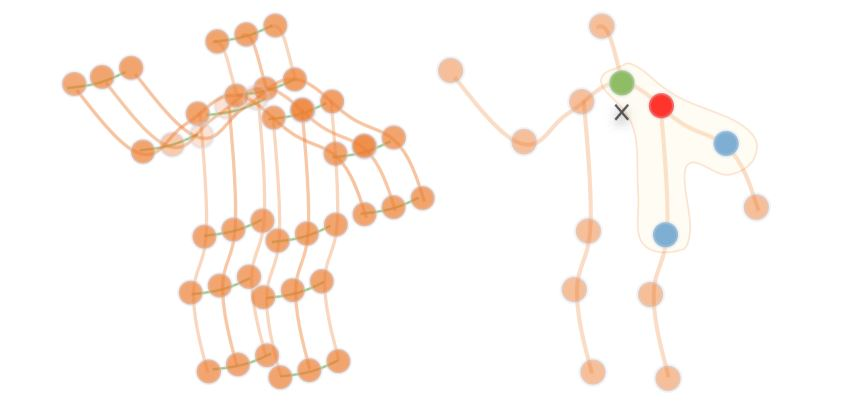

图卷积形式如下: f为特征图，v为节点，B为邻接节点集合，w为权重，l代表节点特有的权重(属于分类节点的哪一类，不同类权重不一样)，Z是集合B节点数目。

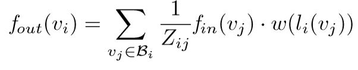

具体实现如下：

K指邻接节点分为几类，如前文所言本文根据与根节点的距离设为3类，

A可以视作是邻接矩阵，W是权重矩阵，M是attention map

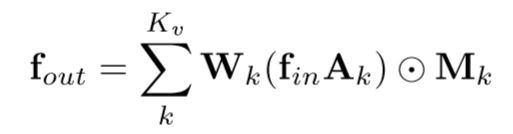

## 自适应(Adaptive)

自适应的目的是为了使得图结构不是固定的，能够根据数据训练出一个比手工权重更适合分类的结构。

A与原本的A一致

B为由数据训练出来的权重矩阵，采用加法是为了能够让原本为零的权重不为零。因为如果图不存在边，A本身是零，无论B的值为多少，AB相乘也必然是零。

C用于计算两个节点特征的相似度，范围为0-1

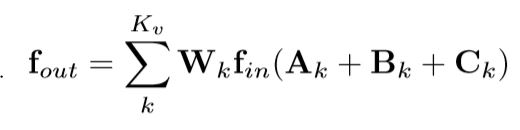

C的值由归一化高斯函数计算所得，如下：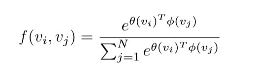

$ \theta$ 和 $\phi $ 是一个1 * 1 的卷积核

具体实现如下：归一化操作即softmax

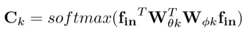

因此最终adaptive GCN layer结构如下所示

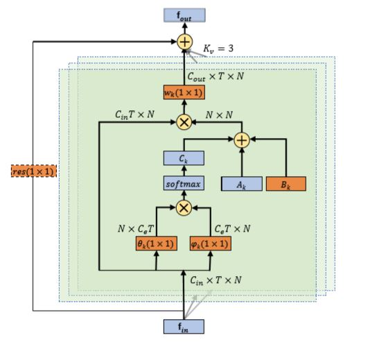

block 如下所示：

Convs 是 spatial GCN，即adaptive GCN layer

Convt 是 temporal GCN，遵循ST-GCN的方式使用k * 1 的卷积核

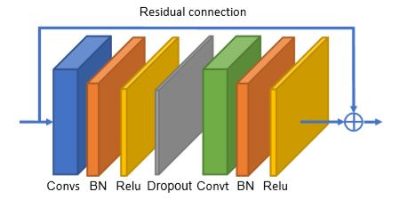

## **双流(two-stream)**

除了一阶信息(关节点joint坐标)外，二阶信息(骨头bone的坐标以及方向）对行为识别任务也能提供许多信息，因此作者对于搭建的网络会分别放入两类输入训练，最终将两个模型融合(fusion)。

对于二阶信息，骨头的坐标为骨头的两个点坐标相减。靠近根节点的为源节点，远离根节点的为目标节点，后者减去前者即为骨头坐标的信息。

因为骨架图是非循环图/树，所以最终骨头的数目会比关节少一个，为了简化网络设计补一个(0,0,0)。

## 实验结果

消融实验：证明自适应模块的作用：

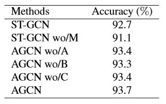

证明双流确实有效

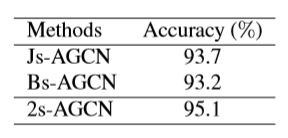

跟其它SOTA方法在NTU 和Kinetics数据集上比较

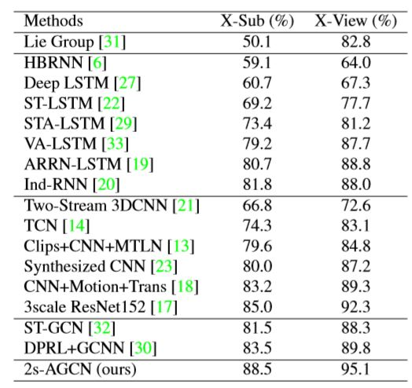

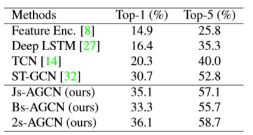

## 小结

该论文最主要的两个点分别为自适应和双流，自适应使得能够自主的构建图结构，双流利用了骨头的信息。

发现这些想法其实有很多论文也有，所以读论文的时候自己要注意吸收然后尝试组合做实验。

比如这篇文章 Skeleton-Based Action Recognition with Directed Graph Neural Network(cvpr2018) 也使用了自适应模块和骨头的信息，并且在NTU-RGB的数据集上效果略好过本文(cvpr 2019)。